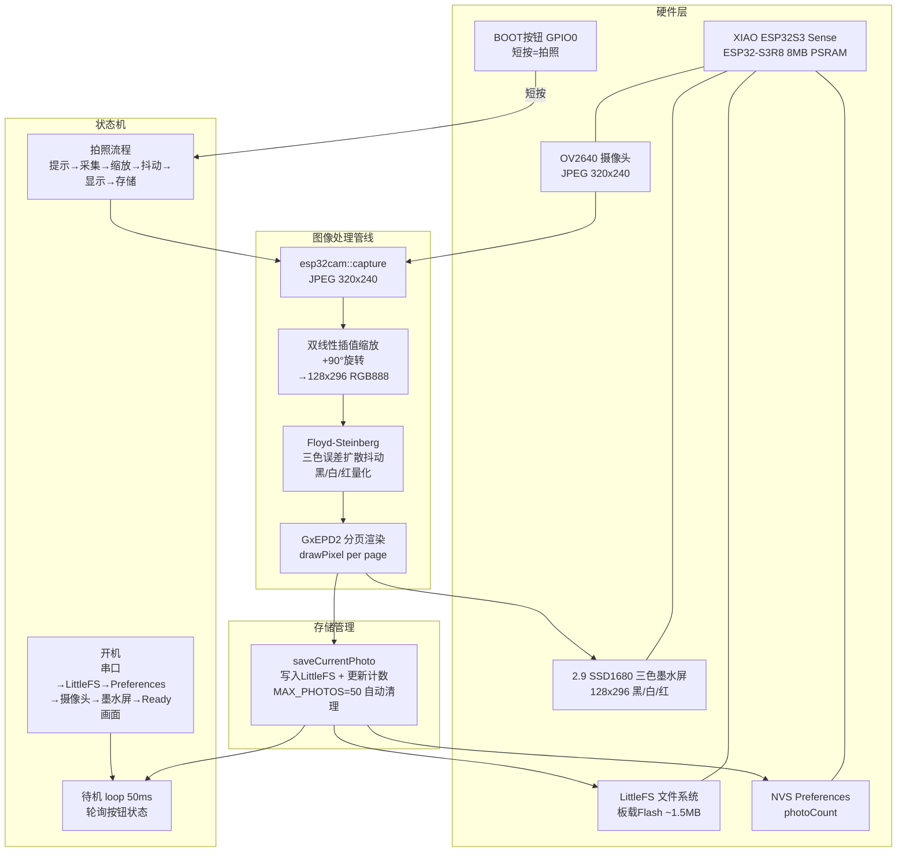

```mermaid
flowchart TD
    subgraph 硬件层
        MCU[XIAO ESP32S3 Sense\nESP32-S3R8 8MB PSRAM]
        CAM[OV2640 摄像头\nJPEG 320x240]
        EPD["2.9 SSD1680 三色墨水屏\n128x296 黑/白/红"]
        BTN[BOOT按钮 GPIO0\n短按=拍照]
        FLASH[LittleFS 文件系统\n板载Flash ~1.5MB]
        NVS[NVS Preferences\nphotoCount]
    end

    subgraph 图像处理管线
        CAP[esp32cam::capture\nJPEG 320x240]
        SCALE[双线性插值缩放\n+90°旋转\n→128x296 RGB888]
        DITHER[Floyd-Steinberg\n三色误差扩散抖动\n黑/白/红量化]
        RENDER[GxEPD2 分页渲染\ndrawPixel per page]
    end

    subgraph 存储管理
        SAVE[saveCurrentPhoto\n写入LittleFS + 更新计数\nMAX_PHOTOS=50 自动清理]
    end

    subgraph 状态机
        BOOT[开机\n串口→LittleFS→Preferences\n→摄像头→墨水屏→Ready画面]
        STANDBY[待机 loop 50ms\n轮询按钮状态]
        CAPTURE[拍照流程\n提示→采集→缩放→抖动→显示→存储]
    end

    BTN -->|短按| CAPTURE
    BOOT --> STANDBY
    CAPTURE --> CAP
    CAP --> SCALE --> DITHER --> RENDER
    RENDER --> EPD
    RENDER --> SAVE
    SAVE --> FLASH
    SAVE --> NVS
    SAVE --> STANDBY

    MCU --- CAM & EPD & FLASH & NVS
    CAM --> CAP
```
